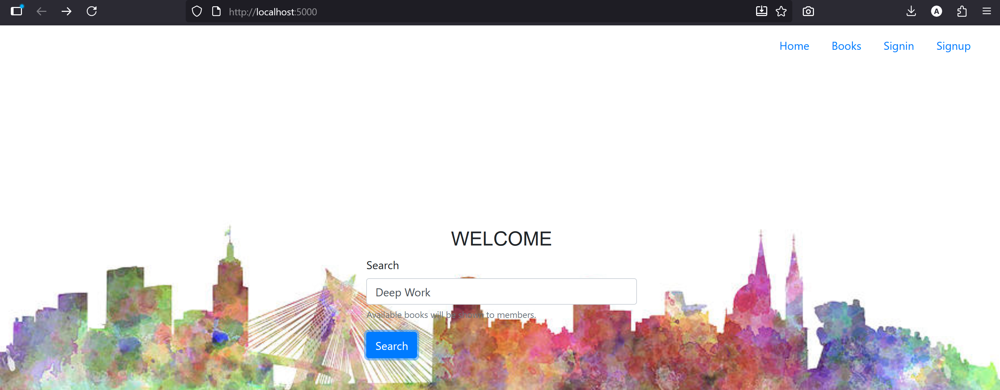
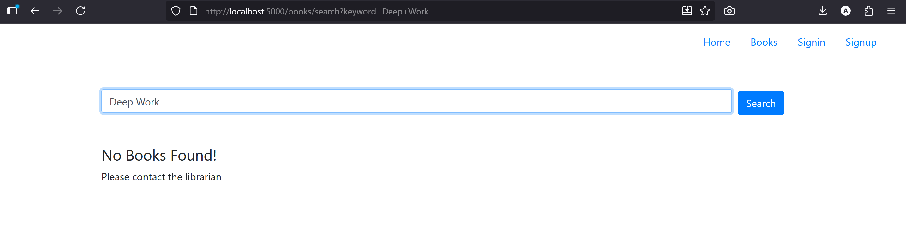
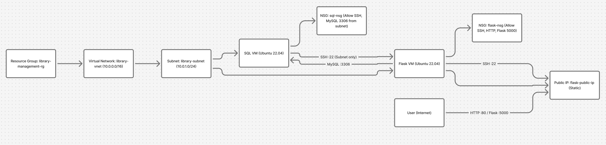
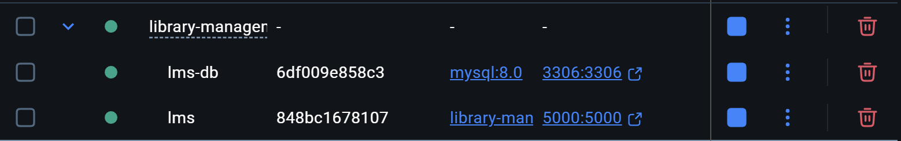
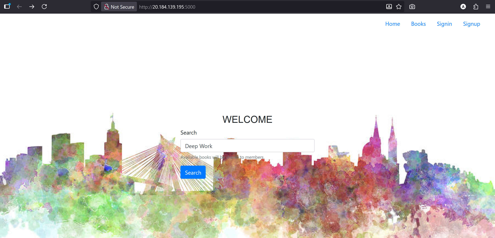
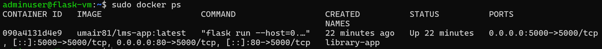
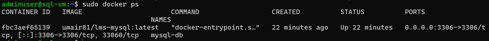

# End-to-End 3-Tier Application Deployment Automation   
A complete DevOps pipeline for a Flask-based Library Management System with automated CI/CD and infrastructure as code.





## Project Overview
This project demonstrates a full DevOps lifecycle:
- **Application:** Flask-based Library Management System.
- **Containerization:** Docker + Docker Compose.
- **CI/CD:** GitHub Actions with automated Docker builds.
- **Infrastructure:** Azure Cloud with Terraform.
- **Deployment:** Automated VM provisioning with custom scripts.

## Technologies Used
- **Backend:** Flask, Python
- **Database:** MySQL
- **Containerization:** Docker, Docker Compose
- **CI/CD:** GitHub Actions
- **Container Registry:** Docker Hub
- **Cloud:** Microsoft Azure
- **Infrastructure:** Terraform
- **Compute:** Azure Virtual Machines

## CI/CD Pipeline
- **Trigger:** On every push to main branch
- **Actions:** 
    - Build Docker images using Docker Compose
    - Run tests
    - Push images to Docker Hub with tags:
        - `umair81/lms-app:latest`

## Docker Images
- **Flask App:** umair81/lms-app
- **MySQL with Schema:** umair81/lms-mysql

## Azure Infrastructure : Terraform Resources
- **Resource Group:** library-management-rg
- **Virtual Network:** 10.0.0.0/16
- **Subnet:** 10.0.1.0/24
- **Virtual Machines:**
    - flask-vm (Standard_B1s) - Public IP, runs Flask app
    - sql-vm (Standard_B1s) - Private IP only, runs MySQL



## Network Security
- Flask VM NSG: Allows SSH, HTTP (80), Flask App (5000)
- SQL VM NSG: Allows SSH and MySQL (3306) only from subnet

## 1. Local Development
- Run with Docker Compose
```
docker-compose up -d
```

- Access application
```
http://localhost:5000
```



## 2. CI/CD Automation
- Push code to GitHub → Automatic build and push to Docker Hub

## 3. Infrastructure Deployment
- Terrafrom command 
```
terraform init
terraform plan
terraform apply
```
- See your app running 
```
http://<flask-vm-public-ip>:5000
```




## Prerequisites
- Docker & Docker Compose
- Azure Account
- Terraform
- Docker Hub Account